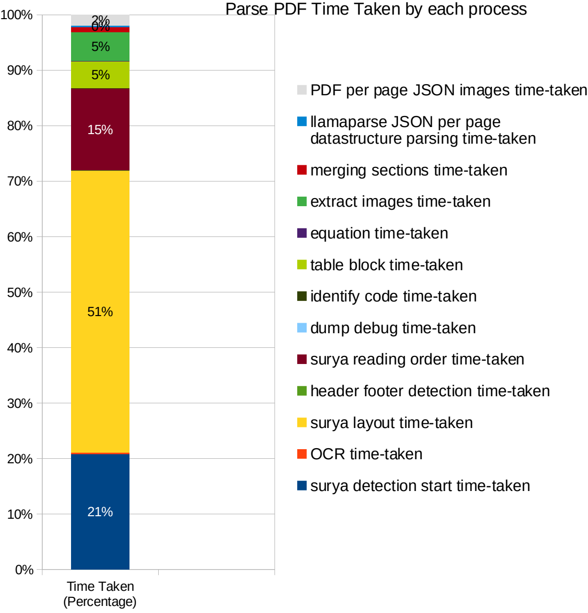
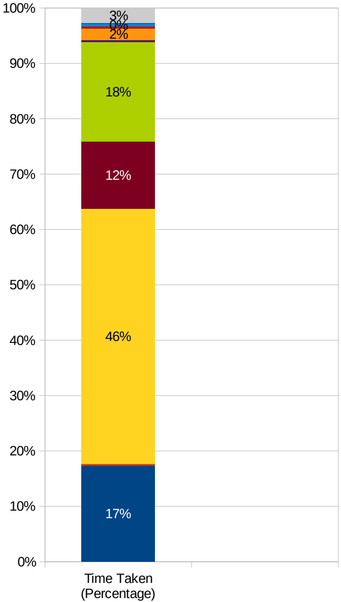

## Table: Most time taken Process

| Time taken | Process |
| --- | --- |
| Almost 50% | Surya layout detection |
| Around 20% | Surya text line dection on pages |
| Around 13% | Surya reading order |
| Around 4% | Extracting images on pages |

| Process | Description |
| --- | --- |
| surya detection time taken | Identify text lines on pages with surya |
| header footer time taken | finding headers and footers on pages |
| table block time taken | Finding tables block on pages |
| per page time taken | Parsing for per page similar to llamaparse Json result |
| Caching time taken | Saving extractions on Minio |
| PDF per page JSON images | Preparing images – key link with minio file path |
| time-taken |  |

## **Analysis Case 1**

File size: 432.5 KiB Include images: 29 Time taken to process: **Average Case** 18 sec 576 ms

## **Analysis Case 2**

File size: 3.7 MiB Include images: 56 Time taken to process: **Average Case** 57 sec 514 ms

- PDF per page JSON images time-taken
- Caching Extraction time taken
- llamaparse JSON per page datastructure parsing time-taken
- merging sections time-taken
- extract images time-taken
- equation time-taken
- table block detection time-taken
- identify code time-taken
- dump debug time-taken
- surya reading order time-taken
- header footer dection time-taken
- surya layout time-taken
- OCR time-taken
- surya detection time-taken

